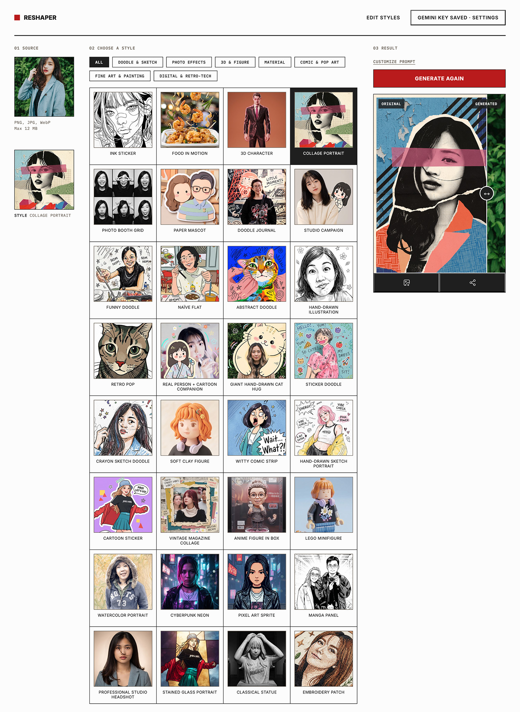

# Reshaper

Reshaper turns a photo into a restyled version of itself, an ink-line sticker, a boxed collectible figure, a stained-glass portrait, a LEGO minifigure, and more, using your own Gemini or OpenAI API key. No shared key, no accounts, no build step, no npm dependencies.

## Features

- **A growing library of styles across several categories** (Doodle & Sketch, 3D & Figure, Material, Comic & Pop Art, Fine Art & Painting, Digital & Retro-Tech, Photo Effects, and more as they're added), filterable from the front page.
- **Bring your own API key** — Gemini or OpenAI, entered client-side, forwarded per-request, never written to disk. No shared/server-stored key, no billing.
- **Before/after comparison slider** on the result, drag to compare the original and restyled photo.
- **Customize prompt** — an opt-in panel to see and edit the exact instruction sent to the model before generating, without changing what's saved for other visitors.
- **Admin panel** (`/admin`) — add, edit, reorder, and delete styles and categories without touching code. Styles are stored in a JSON file, not a database.

## Run locally

1. Install Node.js 18 or newer.
2. In this folder, run `npm start`.
3. Open `http://127.0.0.1:3000`.
4. Open **API settings**, select Gemini or OpenAI, and enter your own API key.
5. Upload a photo, choose a style, and generate.

The API key is kept in the browser page's memory and sent to the local Node process for each validation or generation request. The server does not write keys or images to disk. Each visitor brings their own key — there is no shared/server-stored provider key.

Generation is billed by the selected provider. Gemini supports `gemini-3.1-flash-lite-image`, `gemini-3.1-flash-image`, and `gemini-3-pro-image`. OpenAI uses `gpt-image-2`.

## Admin panel (manage styles and categories)

Styles (title, prompt, identity-mode, category, feature image) and categories (name) are stored in `data/styles.json` and `data/categories.json`, and served to the public page from `GET /api/styles`. Prompt text is never exposed to the public page by default — only `id`, `title`, `imageUrl`, and `category`. A visitor can opt into seeing a style's prompt via the "Customize prompt" panel, which fetches it on demand.

**⚠️ `/admin` has no authentication.** Anyone who can reach the server can add, edit, or delete every style and category through `/admin` and `/admin/api/*` — there is no password, login, or session gate. This is intentional for local/single-user use, but it means you must not expose this server to the public internet as-is. If you deploy it anywhere reachable by others, put it behind your own access control (a reverse proxy with basic auth, a VPN, an IP allowlist, etc.), don't rely on this codebase to gate `/admin` for you.

By default the server binds to `127.0.0.1` (not reachable from other machines). Set `HOST=0.0.0.0` (and put your own auth in front of it) if you need it reachable beyond localhost. `PORT` is also configurable via env var (default `3000`).

Notes:
- Deleting a category doesn't delete the styles that used it, they just fall back to uncategorized.
- `data/styles.json.bak` and `data/categories.json.bak` are kept as backups after every successful save; if either file ever becomes corrupted, the public site keeps working (empty style list) but admin writes are blocked until you restore from the backup.
- `data/uploads/` holds feature images used by styles in this repo's own `data/styles.json`, if you fork this and add your own styles/images, review what you're committing.
